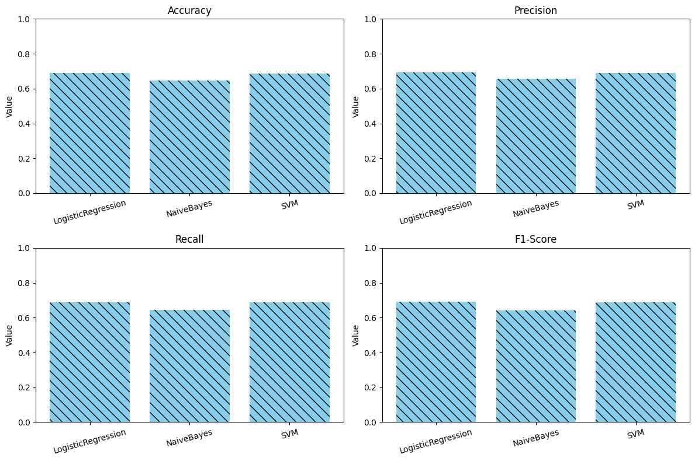
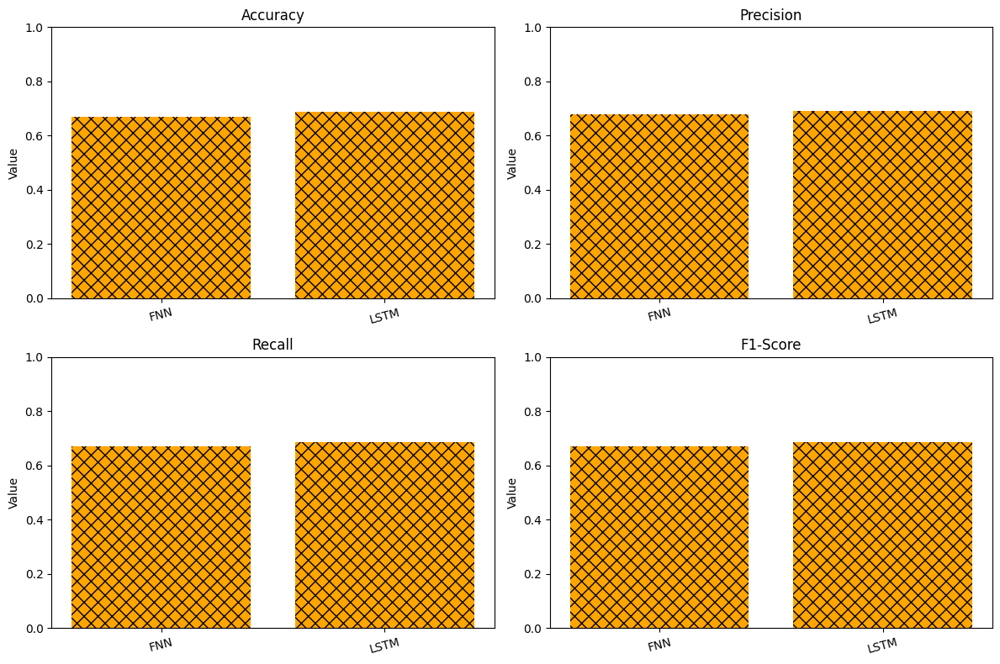
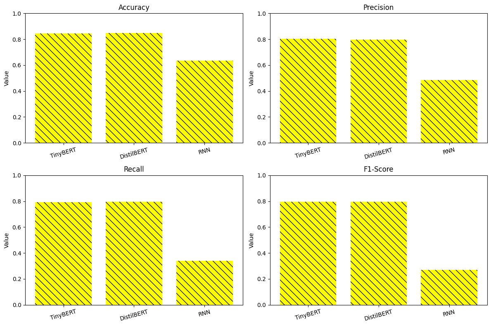

# YouTube Comment Sentiment Analysis

## Overview

This project aims to analyze the sentiment of comments on YouTube videos.  The goal is to provide content creators with a tool to understand public feedback on their videos, enabling them to tailor their content strategy effectively.  The project addresses the challenges of noisy and informal language common in social media, such as slang and vague expressions.

## Features

* **Data Preprocessing**: Cleans and prepares YouTube comment data for analysis.
* **Sentiment Classification**: Classifies comments into three categories: positive, neutral, and negative.
* **Model Variety**: Implements and compares several models, including:
    * TinyBERT
    * DistilBERT
    * Recurrent Neural Network (RNN)
    * Logistic Regression
    * Multinomial Naive Bayes
    * Support Vector Machine (SVM)
    * Feedforward Neural Network (FNN)
    * Long Short-Term Memory (LSTM)
* **Evaluation**: 
Uses standard classification metrics (accuracy, precision, recall, F1-score) for model evaluation.
* **Visualization**:

